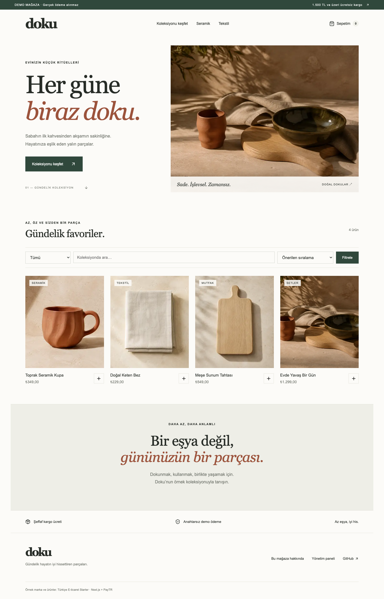

# Türkiye Commerce Starter

**Next.js + PayTR ile Türkiye odaklı açık kaynak e-ticaret başlangıcı.**

Ürün kataloğu, sepet, adres formu, sunucuda hesaplanan fiyatlar, stok rezervasyonu, PayTR iFrame ödeme adaptörü ve temel yönetim paneli. PayTR hesabı olmadan demo ödeme sağlayıcısıyla çalışır.

[English](docs/README.en.md) · [PayTR kurulumu](docs/paytr.md) · [Mimari ve dağıtım](docs/architecture.md)



## Hızlı başlangıç

Node.js **22.13+** gerekir; doğrulanan sürüm 22.22.3. Node SQLite API’si bu sürümde deneysel uyarısı verebilir.

```bash
git clone https://github.com/omergungor11/turkiye-commerce-starter.git
cd turkiye-commerce-starter
npm ci
npm run setup
npm run dev
```

Mağaza: `http://localhost:3000`. Yönetim: `/admin/login`.
`npm run setup`, `.env.local` içinde benzersiz `SESSION_SECRET` ve `ADMIN_PASSWORD` oluşturur. Yönetici parolasını bu dosyadan okuyun; dosyayı paylaşmayın veya Git’e eklemeyin. Mevcut dosya değiştirilmez.

Sepete ürün ekleyin, örnek teslimat bilgileri girin ve başarılı/başarısız demo ödeme seçin. Başarılı siparişi yönetim panelinden kargoya vererek aynı tarayıcıdaki sipariş sayfasında takip numarasını görün. Demo gerçek tahsilat yapmaz.

## Özellikler

- Next.js 16 App Router, React 19, TypeScript ve Node SQLite.
- Mobil uyumlu **Doku** örnek mağazası; arama, kategori, fiyat sıralaması ve ürün detayları.
- Yerel sepet, Türkçe adres formu, TL biçimlendirmesi ve dahil KDV/kargo hesabı.
- Fiyat ve stok sunucudan alınır; gösterilen toplam değişmişse yeniden onay istenir.
- Atomik stok rezervasyonu, sipariş tekrarlarında aynı kayıt, başarısız ödemede tek stok iadesi.
- PayTR token oluşturma ve imzalı callback; tekrarlanan bildirimlere idempotent yanıt.
- Yönetici girişi; ürün ekleme, ad/fiyat/stok/aktiflik düzenleme, siparişler ve kargo takip numarası.
- Ayrı demo, PayTR test ve canlı ödeme kayıtları; testler canlı tahsilat toplamına katılmaz.
- Birim, callback handler ve Playwright tarayıcı testleri; GitHub Actions.

## Özelleştirme

| Dosya                 | İçerik                                      |
| --------------------- | ------------------------------------------- |
| `src/config/store.ts` | Marka, kategoriler ve örnek kargo kuralları |
| `src/lib/seed.ts`     | İlk açılışta oluşturulan örnek ürünler      |
| `src/app/globals.css` | Renkler, tipografi ve sayfa düzeni          |
| `src/app/layout.tsx`  | Başlık, açıklama ve indeksleme ayarı        |
| `public/images/`      | Örnek ürün görselleri                       |

Seed yalnızca boş veritabanında çalışır. Sonraki değişiklikleri yönetim panelinden yapın. Yeni ürün formu örnek görsel seçer; dosya yükleme sistemi içermez. Kendi görselleriniz için API’deki izin verilen görselleri ve form seçeneklerini birlikte güncelleyin.

## Kontroller

```bash
npm run check
npm run build
npx playwright install chromium
npm run test:e2e
```

Tarayıcı testleri 4181 portunda ayrı veritabanı ve test kimlik bilgileri kullanır. PayTR testleri yerel imzalı fixture’larla yürür; gerçek merchant hesabı üzerinden banka/3D Secure testi yapılmış olduğu anlamına gelmez.

## Kullanım sınırları

Kalıcı diski olan **tek Node süreci** için SQLite kullanır; mevcut haliyle Vercel’in geçici dosya sistemine veya çoklu replikaya uygun değildir. [Docker dağıtım tarifi](docs/architecture.md).

Üyelik, e-posta, e-fatura, otomatik kargo entegrasyonu, iade/iptal, kupon, varyant, taksit ve ödeme mutabakat servisi kapsam dışıdır. Misafir siparişleri aynı tarayıcı çereziyle görüntülenir. Ödeme sonucu gelmeyen rezervasyonlar otomatik kaldırılmaz; PayTR sonucu doğrulanmadan stok serbest bırakılmaz.

Örnek marka, ürünler, KDV ve kargo değerleri demo içindir. Demo sayfaları varsayılan olarak `noindex` ayarlıdır. Gerçek mağazaya geçerken işinize ait içerik ve süreçleri tamamlayın.

## Katkı

Hata raporunda tekrar adımlarını ve Node sürümünü ekleyin; merchant anahtarı, adres, çerez veya `.env` göndermeyin. Geliştirmeleri küçük PR’lar halinde ilgili testlerle sunabilirsiniz. Yararlı bulursanız yıldız vermeniz projenin keşfedilmesine yardımcı olur.

MIT © [Ömer Güngör](https://github.com/omergungor11). Doku kurgusal örnek mağazadır. [Görsellerin üretim bilgileri](docs/assets.md).
