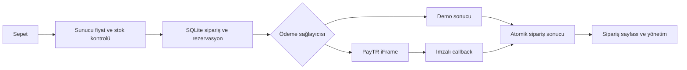

# Mimari ve dağıtım



`commerce.ts` iş kurallarını, `database.ts` şemayı, `paytr-crypto.ts` saf imza fonksiyonlarını içerir. Fiyatlar KDV dahil integer kuruştur; KDV satır başına yuvarlanır. Vergi/kargo değerleri örnektir.

Stok satılabilir miktardır: siparişte azalır, başarısız ödemede bir kere geri gelir, başarıda tekrar azalmaz. Admin stok alanı fiziksel toplam değildir. Ürün düzenlemesi mevcut siparişin fiyat/adres anlık görüntüsünü değiştirmez.

Misafir çerezi rastgele 256-bit değerdir; DB’ye SHA-256 özeti yazılır. Admin çerezi HMAC imzalı, HttpOnly, SameSite=Strict ve 8 saat sürelidir. JSON mutasyonlarında origin doğrulaması; login/checkout için DB tabanlı hız sınırı vardır. HTTPS’te Secure çerez kullanılır.

## Docker

```bash
npm ci
npm run setup
# .env.local APP_URL değerini kullanılan origin ile eşleştirin.
docker compose up --build -d
```

Compose yalnızca `127.0.0.1:3000` açar; SQLite `commerce-data` volume’ünde saklanır. Dış erişim için HTTPS reverse proxy ekleyin. Canlı PayTR için proxy `X-Forwarded-For` başlığını yeniden yazmalıdır. Tek replika kullanın. Env, veri ve Git dosyaları Docker build context’inden hariç tutulur.

`npm run build && npm start` kalıcı diskli Node sunucusunda da çalışır. Docker tarifi verilmiştir. Yerel image build denemesi Docker Hub temel image metadata isteğinde zaman aşımına uğradı; container çalıştırma henüz doğrulanmadı. Node standalone üretim sunucusu yerelde doğrulandı. SQLite’ı Vercel gibi geçici dosya sistemine koymayın. Çoklu replika/serverless için transaction/idempotency davranışını koruyan ortak veritabanına geçin.

## Operasyon ve sınırlar

- WAL modunda tutarlı yedek için SQLite online backup veya uygulama durdurularak DB ve mevcut WAL dosyalarının birlikte yedeği gerekir. Geri yüklemeyi deneyin.
- `npm run setup` mevcut anahtarları değiştirmez. SESSION_SECRET rotasyonu admin oturumlarını geçersiz kılar.
- Demo/test/canlı için ayrı veritabanları kullanın. İlk açılışta örnek ürünler oluşturulur. Gerçek veritabanını yeniden seed amacıyla silmeyin.
- Siparişler kişisel adres/telefon/e-posta içerir; admin/yedek erişimini sınırlayın ve saklama/silme sürecinizi ekleyin.
- Bekleyen rezervasyonlarda otomatik süre dolumu yoktur; önce [sağlayıcı mutabakatı](paytr.md) ekleyin.
- Üyelik, e-posta, e-fatura, iade/iptal, kargo API’si, varyant, kupon ve görsel yükleme kapsam dışıdır.

Birim testleri fiyat, stok, erişim ve imzayı; callback testleri handler’a gönderilen fixture’larla kayıt ve `OK` yanıtını kontrol eder. Playwright mağaza → sepet → demo ödeme → admin kargo → alıcı takip akışını, mobil kataloğu ve erişim kontrollerini çalıştırır. Gerçek PayTR/banka, üretim proxy’si ve Docker host’u yerel testler kapsamında değildir.
